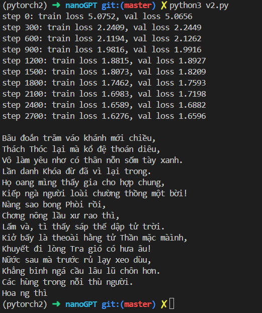

# kieu-gpt

A character-level GPT trained on [Truyện Kiều](https://vi.wikisource.org/wiki/Truy%E1%BB%87n_Ki%E1%BB%81u) by Nguyễn Du — a classic Vietnamese poem of 3,254 verses.

Based on Andrej Karpathy's [nanoGPT](https://github.com/karpathy/nanoGPT) / makemore lecture series.

## Setup

```bash
conda activate pytorch2   # PyTorch is the only dependency
python v2.py              # trains and generates sample text
```

`input.txt` must be present in the working directory (included in this repo).

## Branches

| Branch | Data | Config |
|--------|------|--------|
| `master` | TinyShakespeare | Karpathy's original (n_embd=384, 6 heads, 6 layers) |
| `truyen-kieu` | Truyện Kiều | Tuned for smaller dataset (n_embd=128, 4 heads, 4 layers) |

## Training run



## Hyperparameter notes

Truyện Kiều (~104K chars) is ~10x smaller than TinyShakespeare (~1.1M chars). The original config overfits badly (train loss 0.07, val loss 3.4 by step 3000). Reducing model capacity keeps train/val loss aligned.

| | Shakespeare config | Kiều config |
|---|---|---|
| `n_embd` | 384 | 128 |
| `n_head` | 6 | 4 |
| `n_layer` | 6 | 4 |
| `dropout` | 0.2 | 0.3 |
| `block_size` | 256 | 128 |
| `max_iters` | 5000 | 3000 |
